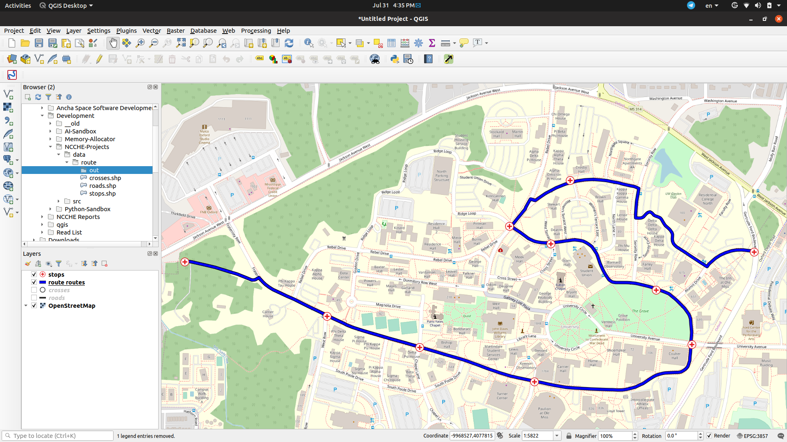

# NCCHE-Projects
Small projects and duties I have done on my training at NCCHE. These works mostly focus on GIS and Python.

For installation, you need to set up the installation procedure on the book "Geoprocessing on Python" by Chris Garrad.

## Guesser
By the given spatial data (points and timestamps), the program guesses the probability of a place by the hour.

## Mapp App
Finds the optimal path for collecting patients. The goal is to index the roads from scratch and use graph traversal to find the shortest path (Dijkstra's Shortest Path is used). For now, it can find the path of given waypoints in order. But it is not the optimal path. This feature will be implemented in the feature.

It is recommended to use QGIS for visualization.

Example Image:

